<div style="text-align:center" align="center">
    <a href="https://chain.link" target="_blank">
        
    </a>

[](https://github.com/smartcontractkit/ccip-javascript-sdk/blob/main/LICENSE)
[](https://docs.chain.link/data-streams/)

</div>

# Chainlink Data Streams Transmitter

## Overview

Chainlink Data Streams Transmitter is a service that bridges off-chain data streams with on-chain smart contracts. It continuously monitors off-chain price updates and pushes them on-chain based on predefined conditions such as price deviations or time intervals.

### Key Features:

- Retrieves and verifies price data from Chainlink Data Streams.
- Writes verified prices to on-chain smart contracts.
- Supports containerized deployment with Docker.
- Configurable through environment variables and Redis-based settings.

---

## Table of contents

- [Chainlink Data Streams Transmitter](#chainlink-data-streams-transmitter)
  - [Overview](#overview)
    - [Key Features:](#key-features)
  - [Table of contents](#table-of-contents)
  - [System Architecture Overview](#system-architecture-overview)
  - [Installation Instructions](#installation-instructions)
    - [Prerequisites](#prerequisites)
    - [Installation Steps](#installation-steps)
  - [Environment Variables](#environment-variables)
  - [YAML Configuration Setup](#yaml-configuration-setup)
    - [YAML Configuration](#yaml-configuration)
    - [Example YAML Configuration](#example-yaml-configuration)
    - [Key Configuration Parameters](#key-configuration-parameters)
  - [Deployment Guide](#deployment-guide)
    - [Running with Docker Compose](#running-with-docker-compose)
    - [Production Deployment](#production-deployment)
  - [WebSocket Reconnect Logic](#websocket-reconnect-logic)
    - [How it works](#how-it-works)
    - [When Reconnect Happens](#when-reconnect-happens)
    - [Reconnect Configuration](#reconnect-configuration)
    - [Retry Logic](#retry-logic)
  - [Infrastructural Considerations](#infrastructural-considerations)
  - [UI](#ui)
    - [UI Setup Instructions](#ui-setup-instructions)
    - [UI usage](#ui-usage)
      - [Streams](#streams)
        - [Contract](#contract)
          - [EVM Contract](#evm-contract)
          - [SVM Program](#svm-program)
        - [Add new data stream](#add-new-data-stream)
      - [Chain](#chain)
        - [Switch chain](#switch-chain)
        - [Add new chain](#add-new-chain)
      - [Schedule](#schedule)
        - [Set new schedule pattern](#set-new-schedule-pattern)
      - [Verifier Contracts](#verifier-contracts)
        - [Set Verifier Contracts](#set-verifier-contracts)
      - [Price delta percentage](#price-delta-percentage)
      - [Gas cap](#gas-cap)
      - [Logs](#logs)
  - [Logging](#logging)
  - [Testing Commands](#testing-commands)
  - [Notes](#notes)
  - [Troubleshooting](#troubleshooting)
    - [Common Issues \& Fixes](#common-issues--fixes)
  - [Modifications \& Further Development](#modifications--further-development)
    - [Modifications](#modifications)
  - [Styling](#styling)
  - [License](#license)
  - [Resources](#resources)

## System Architecture Overview

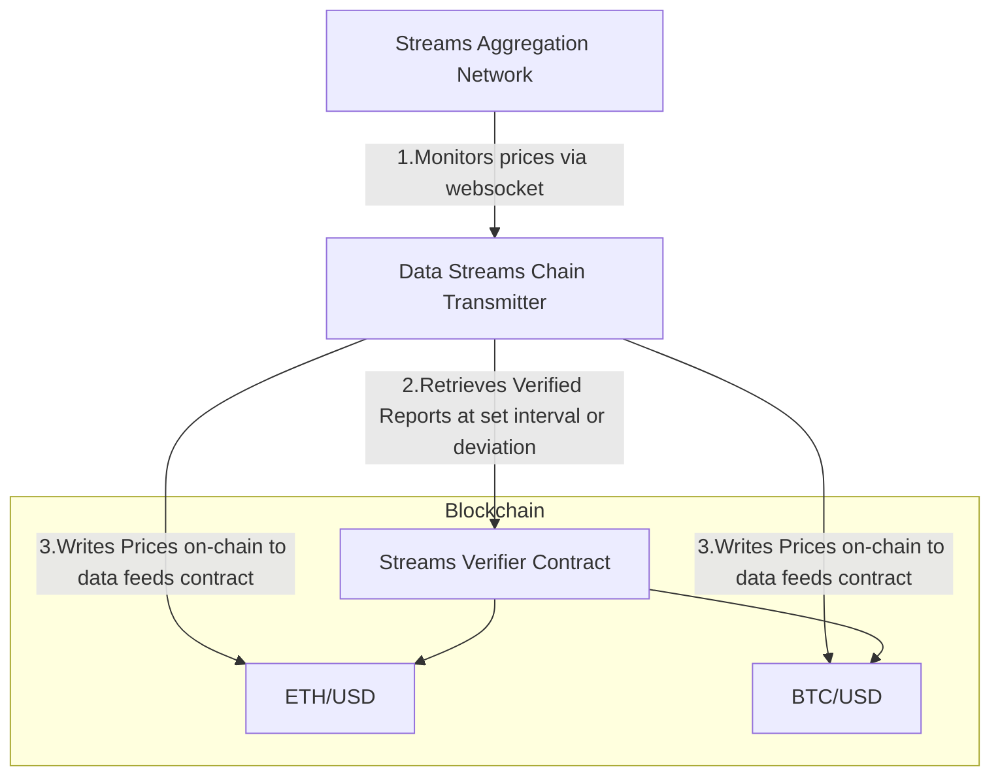
```mermaid
graph TD
    A[Streams Aggregation Network] -->|1.Monitors prices via websocket| B[Data Streams Chain Transmitter]
    B -->|2.Retrieves Verified Reports at set interval or deviation| C[Streams Verifier Contract]
    B -->|3.Writes Prices on-chain to data feeds contract| D[ETH/USD]
    B -->|3.Writes Prices on-chain to data feeds contract| E[BTC/USD]

    subgraph Blockchain
        C --> D
        C --> E
    end
```

---

## Installation Instructions

Before setting up the , ensure you have the required dependencies installed.

### Prerequisites

- **Docker & Docker Compose**: [Install Docker](https://docs.docker.com/get-docker/)
- **Node.js & npm**: [Install Node.js](https://nodejs.org/)
- **Redis** (Optional for local development): [Install Redis](https://redis.io/docs/getting-started/)

### Installation Steps

1. Clone the repository:
   ```sh
   git clone https://github.com/hackbg/chainlink-datastreams-transmitter.git
   cd chainlink-datastreams-transmitter
   ```
2. Copy the example environment file:
   ```sh
   cp .env.example .env
   ```
3. Update the `.env` file with your credential details (explained below) and optionally provide a `config.yml` file following the examples below.

> [!TIP]
> To ensure you won't miss any of the needed variables to be set - you can copy the provided `.env.example` and `config-example.yml` to `.env` and `config.yml` respectively and only fill in the details.

4. Install dependencies:
   ```sh
   npm install
   ```
5. Start the application:
   ```sh
   docker compose up -d
   ```
6. Access the frontend of the application at http://localhost:3000

---

## Environment Variables

To make setting environment variables easier there is a `.env.example` file in the root folder of this project. You can copy it to a new `.env` file and replace the values with your own.

| Name | Description|
| -------------|------------- | 
| `REDIS_HOST`                            | Required for the local persistence layer operation. If not provided the setup will fallback to the default Redis instance which should be running on localhost or 127.0.0.1 if ran with the provided docker compose setup.                                                |
| `REDIS_PASSWORD`                        | Required for the local persistence layer operation. If not provided the setup will fallback to the default Redis password.                                                                                                                                                |
| `PRIVATE_KEY`                           | Used to make payments in LINK for the Data Streams verifications on-chain and for writing data on-chain on the user provided custom contract. This account will be used to pay for the transaction fees in the respective native currency for the target chain specified. |
| `DATASTREAMS_HOSTNAME`                  | Chainlink Data Streams Hostname **with protocol prefix** `https://`. Ex.: `https://api.testnet-dataengine.chain.link`                                                                                                                                                     |
| `DATASTREAMS_WS_HOSTNAME`               | WebSocket Hostname for Data Streams **with protocol prefix** `wss://`. Ex.: `wss://ws.testnet-dataengine.chain.link`                                                                                                                                                      |
| `DATASTREAMS_CLIENT_ID`                 | Client ID for authentication.                                                                                                                                                                                                                                             |
| `DATASTREAMS_CLIENT_SECRET`             | Client Secret for authentication.                                                                                                                                                                                                                                         |  |
| `DATASTREAMS_WS_RECONNECT_ENABLED`      | Automatic websocket reconnect on failure or connection drop. Defaults to `true`                                                                                                                                                                                           |  |
| `DATASTREAMS_WS_RECONNECT_MAX_ATTEMPTS` | Maximum number of reconnect attempts. Defaults to Infinity.                                                                                                                                                                                                               |  |
| `DATASTREAMS_WS_RECONNECT_INTERVAL`     | Websocket reconnect interval. Defaults to 5000ms (5seconds).                                                                                                                                                                                                              |  |
| `DATASTREAMS_WS_RECONNECT_STALE_INTERVAL`     | If in the given interval there are no new reports the transmitter will initiate reconnect. Defaults to 60 000ms (60 seconds).                                                                                                                                                                                                              |  |
| `HEALTH_PORT`                           | (Optional) Port on which the transmitter can be pinged for health check for integration with a monitoring service. Defaults to `8081`.                                                                                                                                    |  |

> [!NOTE]
> All other user configurations are stored locally using Redis file eliminating the need for separate configuration files. This ensures fast access and persistence across sessions without manual file handling. Only sensitive configurations, such as API keys and database credentials, are managed separately in the `.env` file. The application automatically loads and updates configurations in Redis as needed. Users do not need to manually edit or maintain configuration files, simplifying setup and deployment.
>
> Optional: The initial configurations can also be seeded by providing a `config.yml` file. See the `config-example.yml` and section below for more details.

---

## YAML Configuration Setup

Although configurations are stored in Redis, an example YAML configuration is provided for reference. This YAML file can be used to seed the Redis configuration parameters automatically without requiring manual input through the UI. This approach simplifies setup and allows for easier reproducibility of configurations across multiple instances of the service.

Using a YAML file for configuration also makes it possible to replicate a specific setup by copying the file across different instances of the Transmitter. This ensures that deployments remain consistent and eliminates the need for repeated manual configuration when scaling the service.

### YAML Configuration

```yaml
# List of Chainlink Data feeds that the transmitter will subscribe to
feeds:
  # Name of the feed
  - name: 'ETH/USD'
    # Unique identifier for the feed (Ref: https://docs.chain.link/data-streams/crypto-streams?page=1)
    feedId: '0x...'
# The target blockchain network ID (the network the Transmitter will write the data to)
chainId: 43113
# Maximum gas limit. This is the maximum amount of gas you are willing to spend on a transaction.
# If the estimated gas is greater, the transaction will be canceled.
# The value is set in WEI (the smallest unit on the chain).
gasCap: '150000'
# The interval to check for price changes and write on-chain.
# It is represented as a cron expression with granularity in seconds.
# Tip: You can build and verify your cron expression easily using helpers such as https://crontab.guru or refer to the cron-parser library documentation (https://github.com/harrisiirak/cron-parser?tab=readme-ov-file#cron-format).
interval: '* * * * * *'
# The price deviation threshold.
# Only changes that meet or exceed the specified percentage difference will be recorded on-chain.
# This applies in both directions. For example, if you set the threshold to 5%,
# only changes equal to or more than +5% or -5% will be considered valid deviations.
priceDeltaPercentage: 0.01
# Additional EVM chains can be added in this configuration.
chains:
  # Each additional chain should be added to the configuration with the following mandatory properties: id, name, currencyName, currencySymbol, currencyDecimals, rpc.
  # Optional: Set the `testnet` property to 'true' if this is a test network.
  # Removing this property makes the transmitter consider the network a mainnet.
  - id: 995
    name: '🔥 5ireChain'
    currencyName: '5ire Token'
    currencySymbol: '5IRE'
    currencyDecimals: 18
    rpc: 'https://rpc.5ire.network'
# List the Data Streams verifier contract address for each custom chain
verifierAddresses:
  - chainId: 84532
    address: '0x...'
# Target chains to write data on-chain
targetChains:
  # The target blockchain network ID
  - chainId: 43113
    # Target contracts to write data on-chain configuration. Map each feedId to a contract address on the specified chain and
    # set the functionName with the arguments to be called. Contract ABI should also be provided.
    targetContracts:
      - feedId: '0x...'
        # Optional flag to skip report verification by the transmitter before pushing the data to the user provided contract.
        # Defaults to `false`. Set to `true` if you want the transmitter to not verify reports upon delivery.
        skipVerify: false
        address: '0x...'
        functionName: 'functionNameHere'
        functionArgs:
          - 'feedId'
          - 'validFromTimestamp'
          - 'observationsTimestamp'
          - 'nativeFee'
          - 'linkFee'
          - 'expiresAt'
          - 'price'
          - 'bid'
          - 'ask'
        abi: [...]
```

### Example YAML Configuration

```yaml
feeds:
  - name: 'AVAX/USD'
    feedId: '0x0003735a076086936550bd316b18e5e27fc4f280ee5b6530ce68f5aad404c796'
  - name: 'ETH/USD'
    feedId: '0x000359843a543ee2fe414dc14c7e7920ef10f4372990b79d6361cdc0dd1ba782'
chainId: 43113
gasCap: '150000'
interval: '*/30 * * * * *'
priceDeltaPercentage: 0.01
chains:
  - id: 995
    name: '🔥 5ireChain'
    currencyName: '5ire Token'
    currencySymbol: '5IRE'
    currencyDecimals: 18
    rpc: 'https://rpc.5ire.network'
  - id: 84532
    name: 'Base Sepolia Custom'
    currencyName: 'Sepolia Ether'
    currencySymbol: 'ETH'
    currencyDecimals: 18
    rpc: 'https://sepolia.base.org'
    testnet: true
verifierAddresses:
  - chainId: 995
    address: '0x...'
  - chainId: 84532
    address: '0x...'
targetChains:
  - chainId: 43113
    targetContracts:
      - feedId: '0x0003735a076086936550bd316b18e5e27fc4f280ee5b6530ce68f5aad404c796'
        address: '0xfa162F0A25b2C2aA32Ddaacda872B6D7b2c38E47'
        functionName: 'set'
        functionArgs:
          - 'feedId'
          - 'validFromTimestamp'
          - 'observationsTimestamp'
          - 'nativeFee'
          - 'linkFee'
          - 'expiresAt'
          - 'price'
          - 'bid'
          - 'ask'
        abi:
          [
            {
              'inputs':
                [
                  {
                    'internalType': 'bytes32',
                    'name': 'feedId',
                    'type': 'bytes32',
                  },
                  {
                    'internalType': 'uint32',
                    'name': 'validFromTimestamp',
                    'type': 'uint32',
                  },
                  {
                    'internalType': 'uint32',
                    'name': 'observationsTimestamp',
                    'type': 'uint32',
                  },
                  {
                    'internalType': 'uint192',
                    'name': 'nativeFee',
                    'type': 'uint192',
                  },
                  {
                    'internalType': 'uint192',
                    'name': 'linkFee',
                    'type': 'uint192',
                  },
                  {
                    'internalType': 'uint32',
                    'name': 'expiresAt',
                    'type': 'uint32',
                  },
                  {
                    'internalType': 'int192',
                    'name': 'price',
                    'type': 'int192',
                  },
                  { 'internalType': 'int192', 'name': 'bid', 'type': 'int192' },
                  { 'internalType': 'int192', 'name': 'ask', 'type': 'int192' },
                ],
              'name': 'set',
              'outputs': [],
              'stateMutability': 'nonpayable',
              'type': 'function',
            },
          ]
```

### Key Configuration Parameters

- `feeds` - List of price feeds with unique `feedId`s.
- `chainId`: Target blockchain network ID.
- `gasCap`: Maximum gas limit for transactions.
- `interval`: Cron expression defining data update frequency.
- `priceDeltaPercentage`: Minimum price deviation percent before an update is triggered.
- `chains`: List of supported blockchain networks with RPC URLs.
- `verifierAddresses`: The Data Streams verifier contracts for any custom chains added to the config.
- `targetChains`: The blockchain networks where data will be written to.
  - `chainId`: The chainId of the network the target contracts are deployed to.
  - `targetContracts`: The smart contracts to interact with.
    - `functionName`: Name of the smart contract function to call.
    - `functionArgs`: List of required arguments for the contract function.
    - `abi`: Function definition used for contract interactions.

To apply changes, restart the Transmitter using:

```sh
docker compose restart
```

---

## Deployment Guide

The entire application is containerized and is designed to be run using the provided `docker-compose` setup. This ensures a seamless environment by automatically managing all required services, including the local Redis database, WebSocket listeners, logging, verification services, and the frontend management application. Running `docker compose up` will spin up all necessary containers with minimal setup. This approach simplifies deployment, ensures consistency across environments, and reduces configuration overhead. For production use, consider customizing the `docker-compose.yml` file or extending the setup as needed.

Before starting the application, ensure that all necessary environment variables are set in the `.env` file. Missing variables may cause services to fail or behave unexpectedly.

### Running with Docker Compose

1. Ensure the `.env` file is present and you've added the necessary environment variables.
2. Start the service:
   ```sh
   docker compose up -d
   ```
3. To stop the service:
   ```sh
   docker compose down
   ```

### Production Deployment

- Modify `docker-compose.yml` to set up persistent storage and environment variables.
- If the service is going to be accessible externally consider running it behind a reverse proxy like Nginx.

## WebSocket Reconnect Logic

The ChainlinkDataStreamsConsumer includes a built-in reconnect mechanism to ensure persistent data streaming even in the event of unexpected WebSocket disconnections.

### How it works

When the client is connected to the WebSocket via `connect()` or `setConnectedFeeds(...)`, the internal `connectImpl()` method is invoked. This handles socket setup, authentication headers, and subscription.

If the socket closes unexpectedly, the reconnect logic kicks in automatically based on configuration.

### When Reconnect Happens

The client will attempt to reconnect if:

Reconnect is enabled via options (reconnect.enabled === true)

The client was not manually disconnected (i.e., .disconnect() wasn’t explicitly called)

The reconnect attempt count hasn’t exceeded reconnect.maxAttempts

### Reconnect Configuration

Reconnect options can be passed as `env` variables `DATASTREAMS_WS_RECONNECT_ENABLED`, `DATASTREAMS_WS_RECONNECT_MAX_ATTEMPTS` and `DATASTREAMS_WS_RECONNECT_INTERVAL` (see table above).

- Reconnect is enabled by default if not configured by the user otherwise;
- Reconnect `maxAttempts` defaults to `Infinity`, so it will not stop retrying to reconnect in case of connection drop;
- Default interval for reconnect attempt is 5000ms (5 seconds).

### Retry Logic
Each time the WebSocket closes:

If reconnecting is allowed and not manually disconnected, a reconnect attempt is scheduled after interval ms.

The attempt counter increments.

If maxAttempts is exceeded, reconnect stops and an error is logged.


## Infrastructural Considerations

> [!IMPORTANT]
> This project is designed to be self-hosted, meaning that network-level and authorization security controls are the responsibility of the user to implement and manage.

We recommend implementing security controls and equivalent protections at the infrastructure level.

These application-level security controls could be supplemented through the following infrastructural-level recommendations:
- The web server leverages HTTP and does not employ protocol-level encryption and authentication (e.g., TLS), leaving network traffic prone to man-in-the-middle attacks.
  - For a local instance run on your machine, the operator should only interact with the web server over localhost, to avoid a man-in-the-middle attack.
  - For a cloud instance (e.g., AWS), the operator should avoid directly exposing the web server, instead introducing a load balancer that enforces TLS in front of the web server.
- The web server does not employ any authentication mechanism such as credential-based logins. It is accessible by anyone it is exposed to.
  - For a local instance run on your machine, the operator should ensure the guest (container)’s ports that are forwarded to the host cannot be indirectly accessed by another machine through the host over the local network.
  - The system should use Docker configurations to restrict such accesses, or leverage the operating system’s firewall to deny such access.
  - For a cloud instance (e.g., AWS), the operator should not directly expose the web server, instead introducing a gateway component that enforces authentication in front of the web server. Alternatively, operators may opt to not allow external access to the component, leveraging a VPN to access it.
- The web server may be exposed to other components on the same network. An attacker that compromised a component within the same network could use it to access the web server.
  - For a local instance run on your machine, the operator should ensure the guest (container)’s ports that are forwarded to the host cannot be indirectly accessed by another machine through the host over the local network.
  - The system should use Docker configurations to restrict such accesses, or leverage the operating system’s firewall to deny such access.
  - For a cloud instance (e.g., AWS), the operator should enforce strict ingress/egress rules that allow only expected component communications.
  E.g., with three components, A, B, and C, where only A should communicate
with C, but B should not, ingress and egress rules can be used to enforce these patterns.

Additionally, consider the following:
- Although the Redis server should never be publicly exposed, it should nonetheless be hardened by employing [TLS configurations](https://redis.io/docs/latest/operate/oss_and_stack/management/security/encryption/) to mitigate a man-in-the-middle attack by someone who gained an initial foothold within the network.

---

## UI

### UI Setup Instructions

The Transmitter provides a UI for managing feeds. It is automatically enabled if you start the transmitter using the Docker compose file as mentioned in the instructions above.

To start it manually outside of the docker setup:

1. Start the UI service using:
   ```sh
   npm run dev
   ```
2. Access it via `http://localhost:3000`.

> [!NOTE]
> The UI requires a running Redis instance. Make sure a Redis instance is running and the authentication credentials are set in the `.env` file when running the UI outside of the containerized setup in the docker configuration.

### UI usage

> [!NOTE]
> If a configuration YAML file is provided, its content gets saved in the local Redis instance on the first start of the transmitter. The UI will automatically load the settings from the Redis store instance when opened. Otherwise, if there is no initial configuration provided - the interface will start with an empty state, requiring the user to enter all details manually. The following sections explain how to complete the configuration step by step.

#### Streams

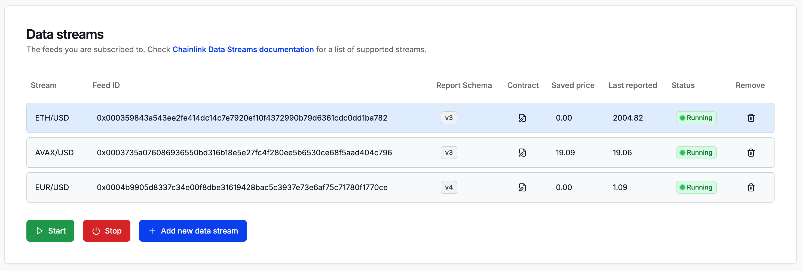

First section allows monitoring and managing of the streams. Each row contains the following info/action:

- `Stream`: The name of the stream. This is the name set by the user for easier tracking and feed identification.
- `Feed ID`: Check [Chainlink Data Streams Documentation](https://docs.chain.link/data-streams/crypto-streams) for a list of supported streams.
- `Report Schema`: Currently [Report Schema v3](https://docs.chain.link/data-streams/reference/report-schema) and [Report Schema v4](https://docs.chain.link/data-streams/reference/report-schema-v4) are supported
- `Contract`: Preview and edit the contract properties. Each feed can be recorded in a separate contract on the configured target chain. Check the [Contract](#contract) section for more information.
- `Saved price`: The latest price recorded onchain.
- `Last reported`: The latest price reported by the stream.
- `Status`: Current status of the stream. The added stream can be in one of the following states: `Running`, `Connecting`, `Stopping` or `Stopped`
- `Remove`: This action button can be used to remove the feed from the list and stop tracking its reports.
- `Start`: Action button to Start or resume all data streams.
- `Stop`: Action button to Stop all the streams.
- `Add new data stream`: A button leading to the section for adding a new feed to the list so the transmitter can start tracking it.

##### Contract

Clicking the contract icon  in the table above opens the contract configuration page. This page allows users to view and edit contract properties for the stream on the currently connected chain. Depending on the current network (EVM or SVM) the following options are available

###### EVM Contract

Add custom contracts, define ABI, and specify functions to store feed results.

**Contract address**
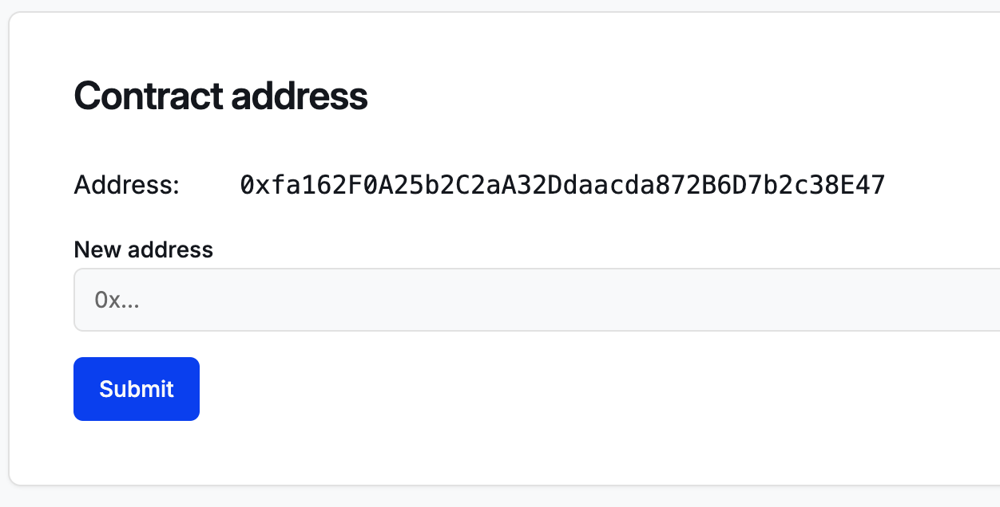

View/Add or Edit the target contract address.

**Skip Report Verification**
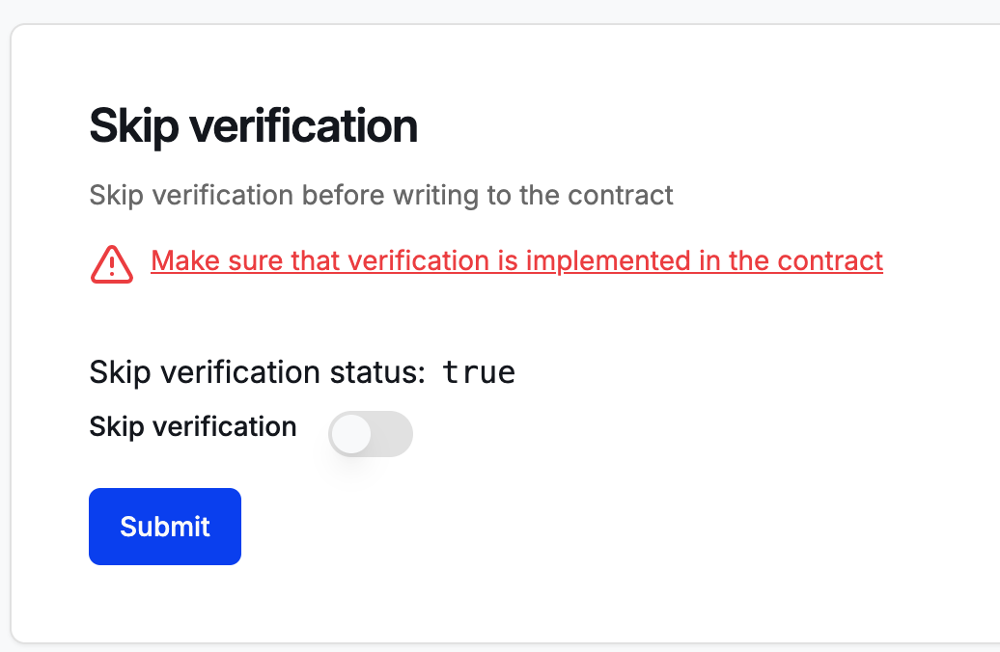

This setting allows you to configure the transmitter to bypass off-chain report verification before submitting the transaction to the specified contract on-chain.

- Default Behavior:
  - If this option is not enabled, the transmitter will automatically perform off-chain report verification before submitting reports to the blockchain. The transmitter will submit the received data to on-chain Chainlink verifier contracts to verify the correctness of the report and to ensure it originated from Chainlink's DON before submitting the data to the user provided contract.
    - > [!WARNING]
      > The transmitter side report verification could be a paid operation depending on the selected destination chain. Refer to the documentation for more information on [Data Streams Billing](https://docs.chain.link/data-streams/billing).
- Important Considerations:
  - Enabling this option means skipping the off-chain verification step, which could expose your system to risks if the contract's verification mechanism is not robust.

> [!WARNING]
> Only enable this setting if you have thoroughly implemented and verified the on-chain report verification mechanism in the contract. For an example of how to implement on-chain report verification, refer to the [on-chain report verification documentation]((https://docs.chain.link/data-streams/reference/streams-direct/streams-direct-onchain-verification#interfaces)).

**Function**
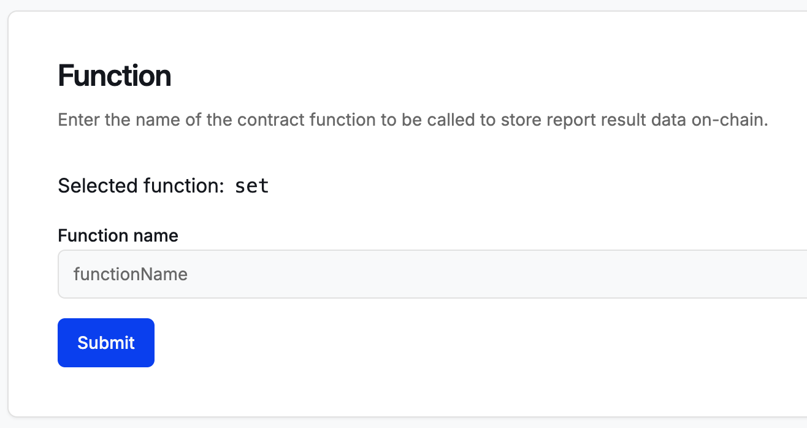

View/Add or Edit the name of the target contract function to be called to store report result data on-chain.

**Arguments**
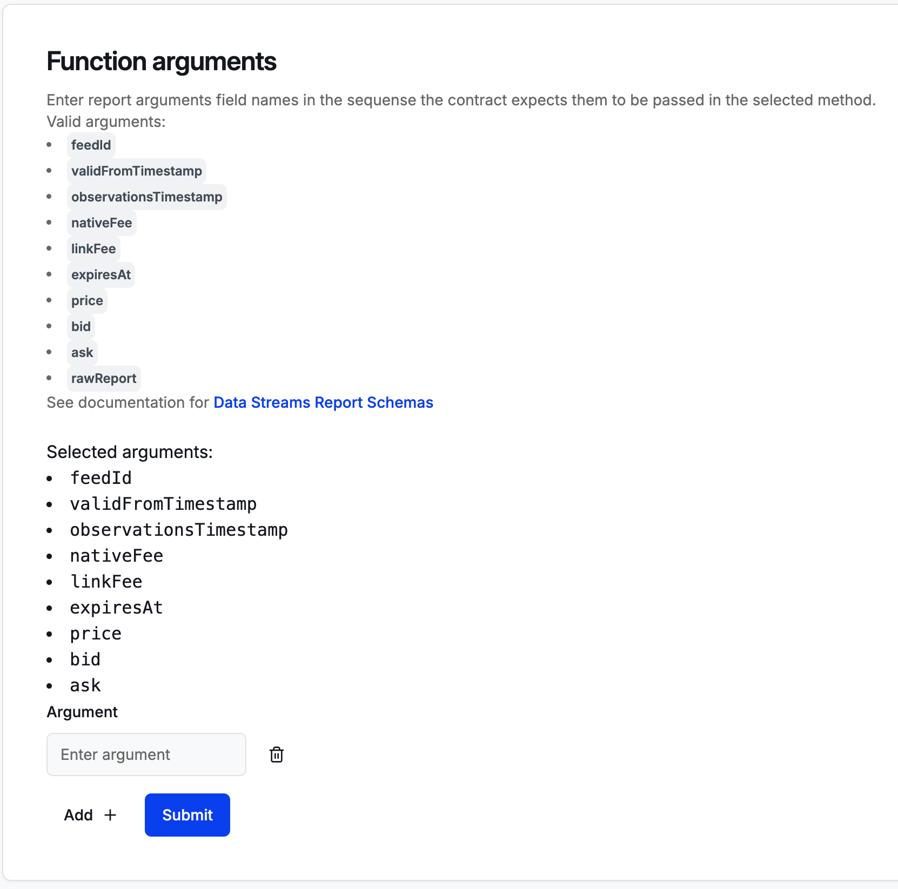

View, add, or edit the report argument field names in the exact order the contract expects them. Refer to the [Data Streams Report Schemas Documentation](https://docs.chain.link/data-streams/reference/report-schema) for more details.

**ABI**


View/Add or Edit the ABI of the target contract.

###### SVM Program

Add custom program, define IDL and specify instructions to store feed results.

**Instruction**
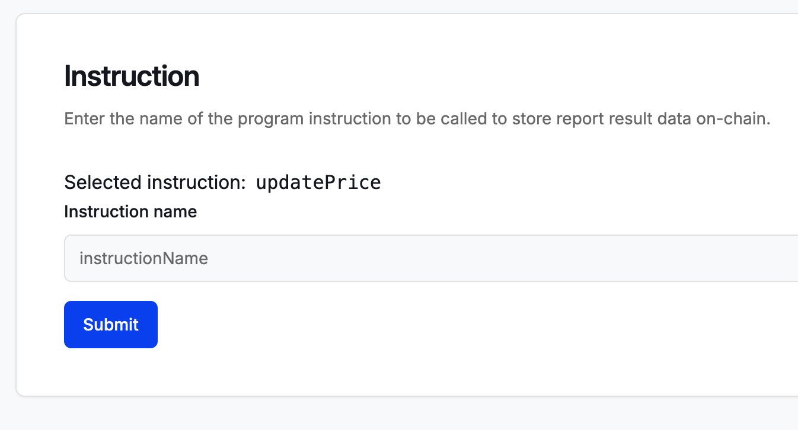
View/Add or Edit the name of the target program instruction to be called to store report result data on-chain.

**Instruction arguments**

View, add, or edit the report argument field names and type (number or string) in the exact order the program expects them. Refer to the [Data Streams Report Schemas Documentation](https://docs.chain.link/data-streams/reference/report-schema) for more details.

**Program Derived Address (PDA)**
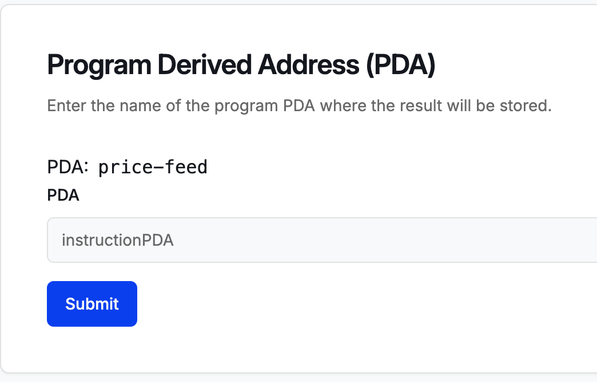
View, add or edit the name of the program PDA where the result will be stored.

**IDL**
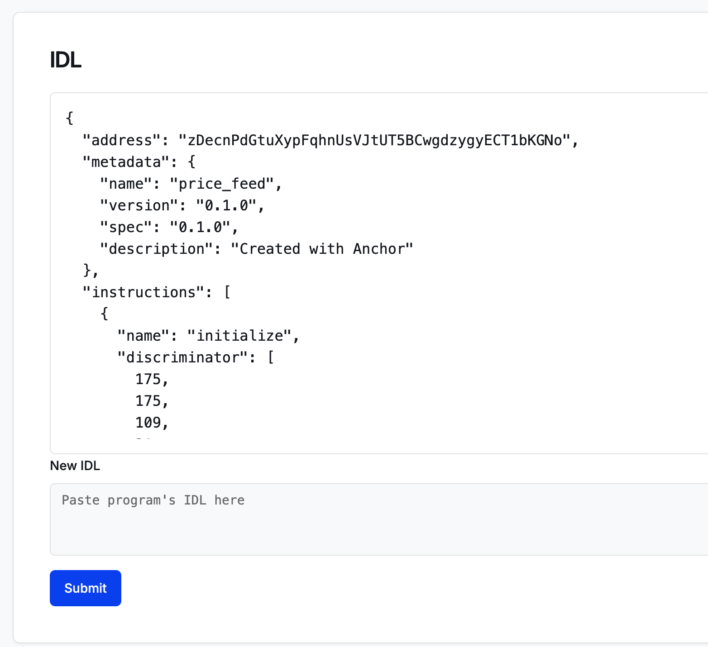
View/Add or Edit the IDL of the target program.

---

##### Add new data stream

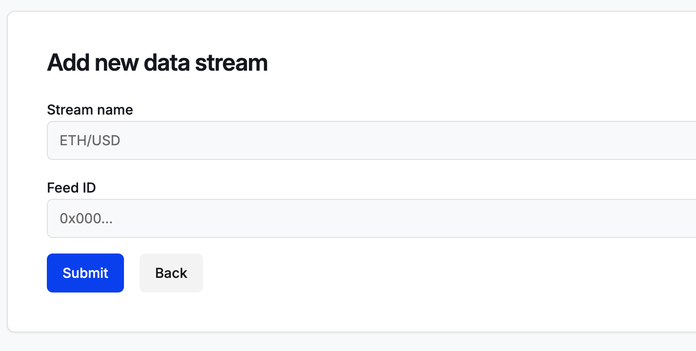

Add new data stream feed.

- `Stream name`: This is an arbitrary name input. It is recommended to be the pair of the feed, ex. `ETH/USD`
- `Feed ID`: The Id of the stream. It can be obtained from the documentation (for public feeds) or by contacting your Chainlink representative.

---

#### Chain

To view information and settings for the currently connected chain (a.k.a. target chain), click the address button in the upper right corner . This will open a pop-up displaying:

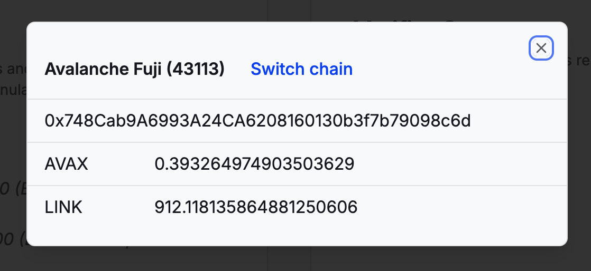

- The name and ID of the connected chain
- A button to switch chains
- The connected account address (used for paying the fees for the on-chain transaction fees and LINK fees)
- The account balance of the chain's native currency
- The account balance of LINK on the current chain

##### Switch chain

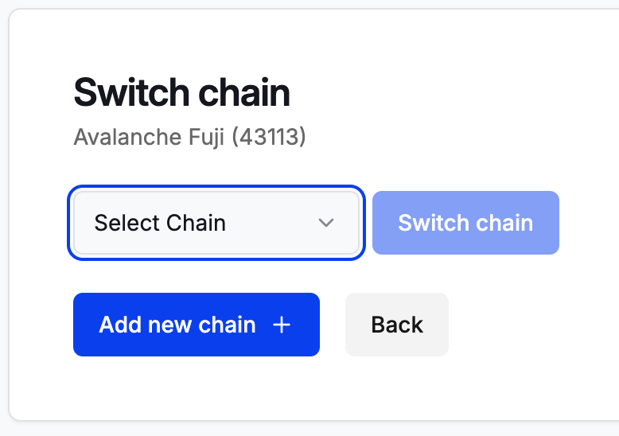

- A dropdown menu with all the available chains
- Add new chain option

##### Add new chain

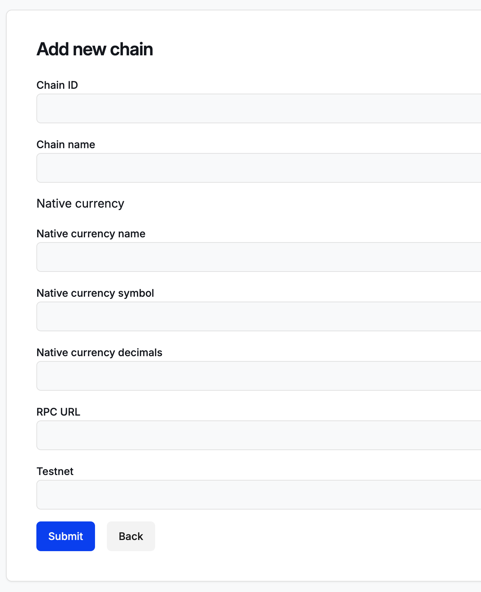

Any EVM network can be easily added. The following fields are mandatory:

- `Chain ID`
- `Chain name`
- `Native currency name`
- `Native currency symbol`
- `Native currency decimals`
- `RPC URL`
  Optional:
- `Testnet` - this flag indicates if the chain is a testnet. Leave blank for mainnet chains.

---

#### Schedule

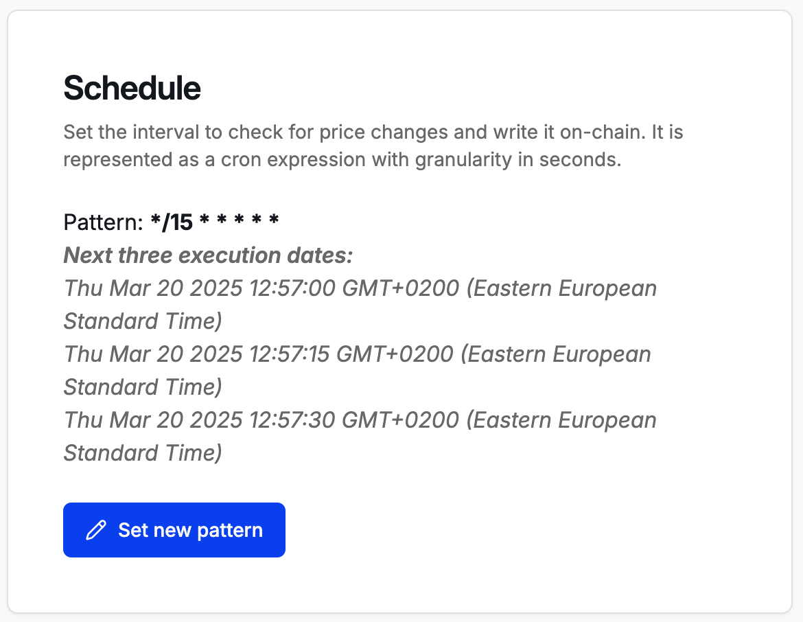

Set the interval for checking price changes and writing them on-chain. This interval is defined using a cron expression with second-level granularity.

##### Set new schedule pattern

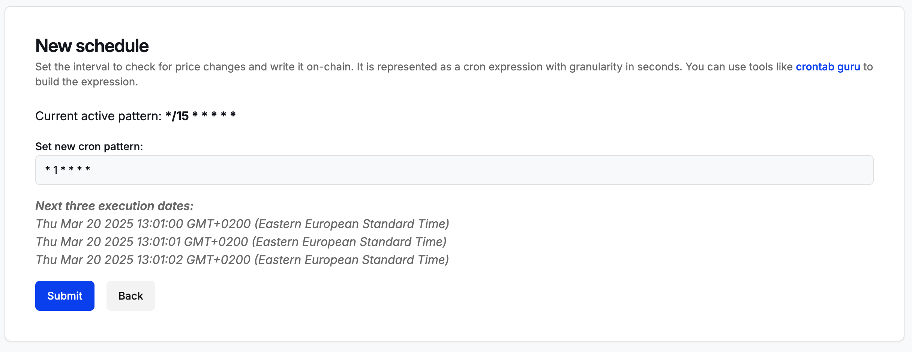

Set the interval for checking price changes and writing them on-chain. This interval is defined using a cron expression with second-level granularity. You can use tools like [crontab guru](https://crontab.guru/) to build the expression or refer to the [cron-parser](https://github.com/harrisiirak/cron-parser?tab=readme-ov-file#cron-format) library documentation.

---

#### Verifier Contracts

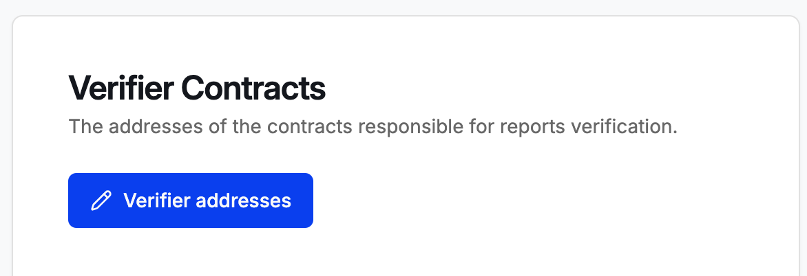

The addresses of the contracts responsible for reports verification.

##### Set Verifier Contracts

This contract verifies the signature from the DON to cryptographically guarantee that the report has not been altered from the time that the DON reached consensus to the point where you use the data in your application. Check out up-to-date contract addresses and more information in [Streams Verifiers Documentation](https://docs.chain.link/data-streams/crypto-streams?page=1#streams-verifier-network-addresses)

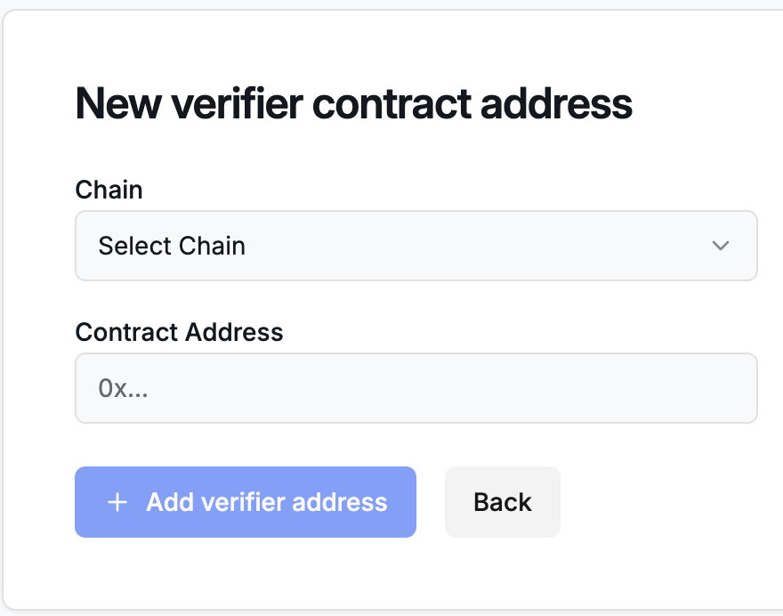

- Select the chain from the dropdown
- Input the contract address

---

#### Price delta percentage

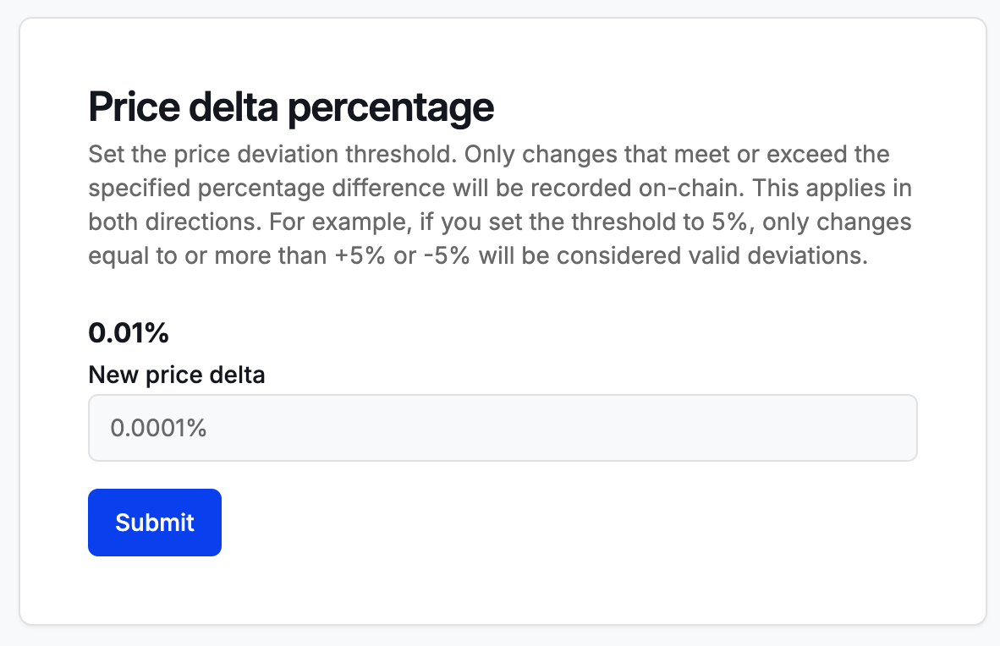

Set the price deviation threshold. Only changes that meet or exceed the specified percentage difference will be recorded on-chain. This applies in both directions.

For example, if you set the threshold to 5%, only changes equal to or more than +5% or -5% will be considered valid deviations.

---

#### Gas cap


Set the maximum gas limit for a transaction, specified in WEI (the smallest unit on the chain). If the estimated gas exceeds this limit, the transaction will be canceled.

---

#### Logs

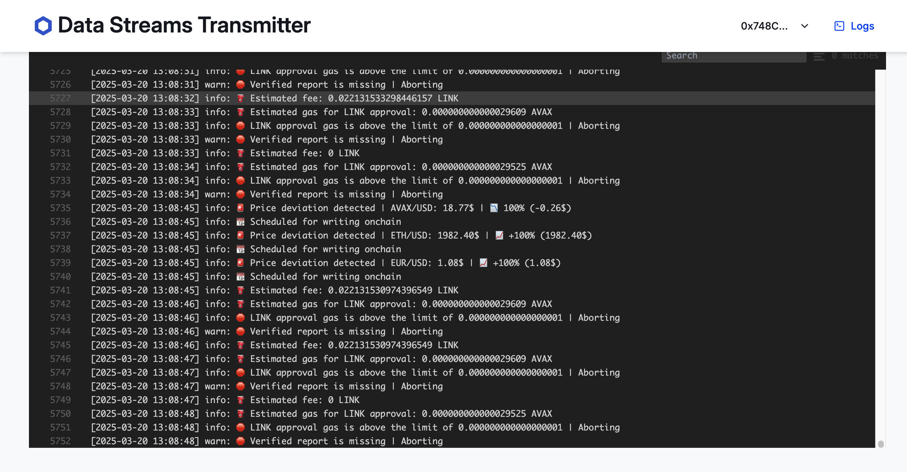

Displays logs in real time.

---

## Logging

The application supports different logging levels:

- **INFO**: General system status.
- **DEBUG**: Detailed debugging output.
- **ERROR**: Critical failures.

Logs can be accessed via:

```sh
docker logs -f transmitter
```

The application stores logs in the `logs` directory to maintain an audit trail of user actions and configuration changes. They can also be used for troubleshooting..

---

## Testing Commands

The project comes with unit testing suite using Jest that ensures verification of reports and writing the results to the chain work as expected.

Run tests:

```sh
npm run test
```

After deployment, verify the setup with:

- Verify logs:
  ```sh
  docker logs transmitter
  ```

---

## Notes

> [!IMPORTANT]
> The Transmitter uses [cron-parser](https://github.com/harrisiirak/cron-parser?tab=readme-ov-file#cron-format) for handling cron expressions.
>
> The cron-parser dependency is noted to lose some pattern information when serializing a cron pattern, such as “?” characters. The transmitter is also prone to this when setting a schedule cron pattern using "?" character which is an alias for "*" in cron-parser.
>
> For example, using “* * * ? * *” will actually set “* * * * * *”, where in other libraries the “?” character denotes an unspecified one-of (“?”), but not all (“*”).
>
>Make sure to check and test your cron expressions.

## Troubleshooting

### Common Issues & Fixes

- **Service not starting?**
  - Ensure `.env` file is correctly configured.
  - Run `docker compose logs` for errors.
- **Data not updating?**
  - Verify the RPC endpoint.
  - Check Redis for correct configurations.
- **Authentication failures?**
  - Ensure `DATASTREAMS_CLIENT_ID` and `DATASTREAMS_CLIENT_SECRET` are valid.

---

## Modifications & Further Development

For development, you can either use the provided docker-compose setup or run services manually. To start the application in a containerized environment, use:

```sh
docker compose up -d --build
```

> [!NOTE]
> Using the `--build` flag in the above command ensures the changes you've made to the project are present in the newly built docker image.

If you prefer running the application locally, ensure that Redis is installed and running. Then, install dependencies and start the application:

```sh
npm install
npm run dev
```

Modify the `.env` file as needed for local development. Logs and debugging tools are integrated to assist with development and troubleshooting.

### Modifications

If you're familiar with deploying Node applications, the built-in Remix app server is production-ready.

Make sure to deploy the output of `npm run build`

- `build/server`
- `build/client`

If you're making changes to the application, restart the affected services or use hot-reloading where supported to apply modifications efficiently.

First, build your app for production:

```sh
npm run build
```

Then run the app in production mode:

```sh
npm start
```

## Styling

This template comes with [Tailwind CSS](https://tailwindcss.com/) already configured for a simple default starting experience. You can use whatever css framework you prefer. See the [Vite docs on css](https://vitejs.dev/guide/features.html#css) for more information.

## License

This project is licensed under the GNU General Public License (GPL). This means you are free to use, modify, and distribute the software, provided that any derivative work is also licensed under the GPL.

By contributing to this project, you agree that your contributions will be governed by the same license. For full details, see the LICENSE file.

## Resources

- [Chainlink Data Streams Documentation](https://docs.chain.link/data-streams)
- [Chainlink Documentation](https://docs.chain.link/)
